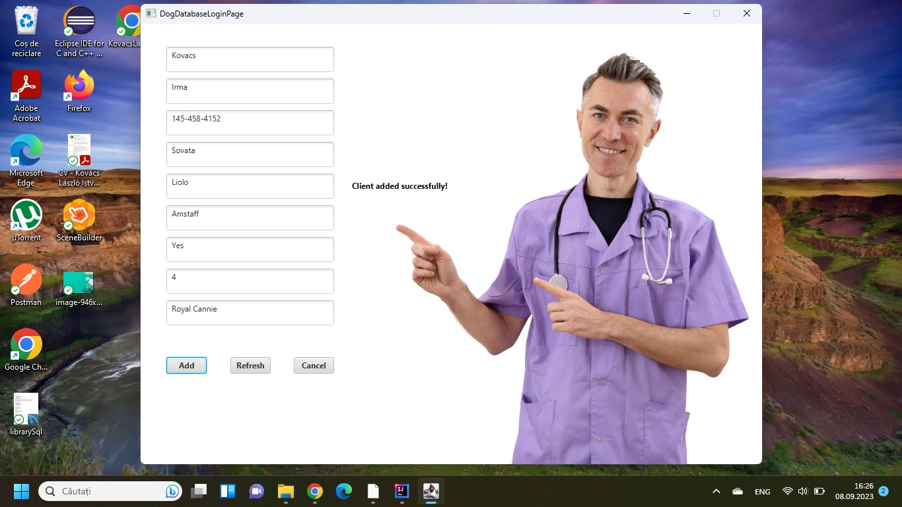

# Dog Health Care System

Welcome to the Dog Health Care System! This comprehensive Java-based application is designed to help dog owners and veterinarians manage their dog's health records efficiently. Users can log in using a default account or sign up for a new account.

## Table of Contents

- [Features](#features)
- [Screenshots](#screenshots)
- [Getting Started](#getting-started)
  - [Prerequisites](#prerequisites)
  - [Installation](#installation)
    - [Database Setup](#database-setup)
  - [Running the Application](#running-the-application)
- [Usage](#usage)
  - [Logging In](#logging-in)
  - [Main Dashboard](#main-dashboard)
  - [Dog Health Management](#dog-health-management)
- [Default Account](#default-account)
- [Contributors](#contributors)
- [License](#license)
- [Acknowledgments](#acknowledgments)

## Features

### User Authentication

- **Secure Login**: Users can securely log in with a unique username and password.
- **User Registration**: New users can create accounts to access the application.

### Dog Health Management

- **Add Dogs**: Easily add new dogs to the database with comprehensive health details.
- **Update Dog Health Records**: Update dog health information as needed.
- **Delete Dogs**: Remove dogs from the database when they are no longer needed.
- **Search Dogs**: Efficiently find dogs based on various health criteria.
- **Clear Input Fields**: Input fields are automatically cleared after successful actions for a seamless user experience.

### Database Storage

- **Data Persistence**: Dog health data is stored in a MySQL database for data integrity and easy retrieval.

## Screenshots

### Login Screen


### Sign Up Screen


### Add PetScreen


### Main Application Screen


## Getting Started

### Prerequisites

Before using the Dog Health Care System, ensure you have the following prerequisites installed:

- **Java Development Kit (JDK)**: The application relies on Java, so make sure you have it installed.
- **MySQL Database Server**: A MySQL server is required to store and manage dog health data.
- **MySQL Connector/J (JDBC driver)**: You need this to connect the application to the MySQL database.

### Installation

1. Clone this repository to your local machine using the following command:

```bash
git clone <repository-url>
```

#### Database Setup

2. Set Up the MySQL Database:

   - Create a MySQL database named "DogHealthDB".
   - Create a table named "DogHealthRecords" with columns "dog_name," "age," "weight," "vaccination_status," "last_checkup_date," and "owner_name." Here's a sample SQL command to create the table:

   ```sql
   CREATE TABLE DogHealthRecords (
       dog_name VARCHAR(255) NOT NULL PRIMARY KEY,
       age INT,
       weight DECIMAL(5, 2),
       vaccination_status VARCHAR(50),
       last_checkup_date DATE,
       owner_name VARCHAR(255)
   );
   ```

   - You can use a MySQL client or a tool like phpMyAdmin to execute this SQL command.

3. Configure Database Connection:

   - Open the `AppController.java` file.
   - Modify the `jdbcUrl`, `dbUsername`, and `dbPassword` variables to match your database configuration.

### Running the Application

1. Run the application by executing the `DogHealthApp.java` file.

## Usage

### Logging In

1. **Log In**: Use the default account or sign up for a new account.

2. **Default Account**: You can use the default account to log in:

   - **Username**: "user1"
   - **Password**: "password1"

### Main Dashboard

1. **Main Dashboard**: Once logged in, you'll have access to the main dashboard, where you can:

   - **Add Dogs**: Easily add new dogs by filling in comprehensive health details.
   - **Update Dog Health Records**: Modify existing dog health information as needed.
   - **Delete Dogs**: Remove dogs from the database when they are no longer needed.
   - **Search Dogs**: Efficiently find dogs based on various health criteria.

2. **Clear Input Fields**: Input fields are cleared automatically after a successful action, providing a smooth user experience.

## Default Account

You can use the default account to log in:

- **Username**: "user1"
- **Password**: "password1"

## Contributors

- Kovács László István


